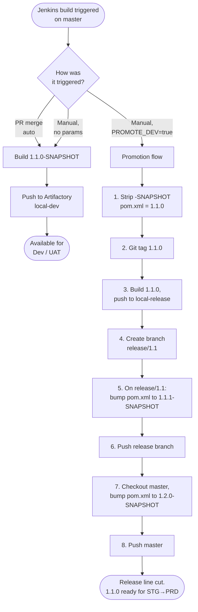
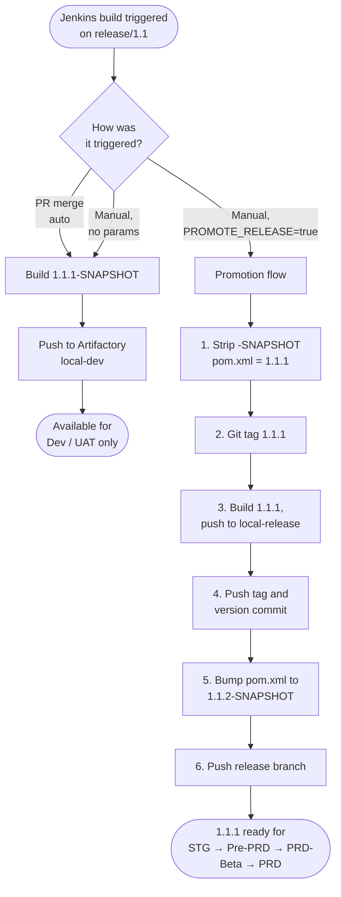
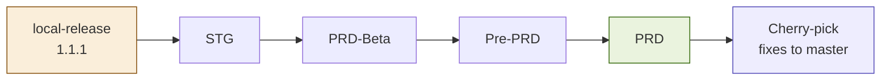
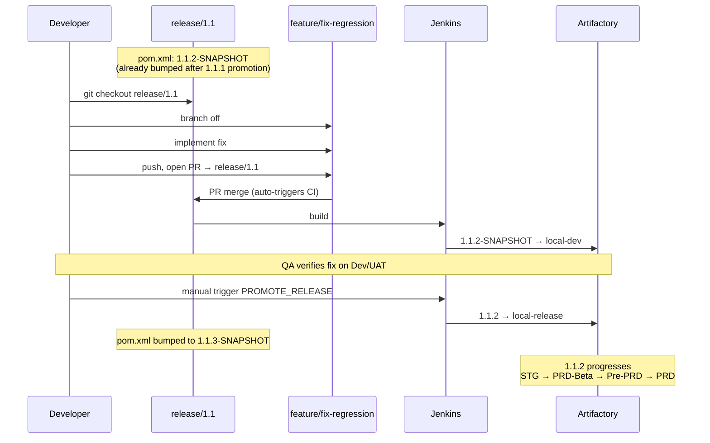

# Java Maven CI/CD — Developer Guide

> **Audience:** Developers working on Java/Maven applications using this CI/CD pipeline.
> **Goal:** After reading this once, you should know exactly which branch to commit to, what version to expect in your build, what the Jenkins parameters do, and where your artifact will land — without asking anyone.

---

## Table of Contents

1. [TL;DR — The 60-Second Version](#1-tldr--the-60-second-version)
2. [Branches You'll See](#2-branches-youll-see)
3. [What Each Version Number Means](#3-what-each-version-number-means)
4. [Master Branch — How It Works](#4-master-branch--how-it-works)
5. [Release Branch — How It Works](#5-release-branch--how-it-works)
6. [Deployment Environment Sequence](#6-deployment-environment-sequence)
7. [Fixing Bugs After Release](#7-fixing-bugs-after-release)
8. [Full Worked Example](#8-full-worked-example)
9. [FAQ — "What Do I Do When…"](#9-faq--what-do-i-do-when)
10. [Cheat Sheet](#10-cheat-sheet)
11. [Glossary](#11-glossary)

---

## 1. TL;DR — The 60-Second Version

- **Commit your daily work to `master`.** Every PR merge produces a `-SNAPSHOT` artifact deployable to **Dev / UAT only**.
- **Production releases come from `release/X.Y` branches**, not from master.
- A release manager cuts a `release/X.Y` branch by running the master pipeline manually with `PROMOTE_DEV=true`.
- A release manager produces a production-ready build by running the release-branch pipeline manually with `PROMOTE_RELEASE=true`.
- **Snapshots never reach STG/Pre-PRD/PRD-Beta/PRD.** Releases never reach Dev/UAT. The two worlds are kept strictly apart by which Artifactory repository the artifact lives in.
- **If you find a bug in production**, branch from `release/X.Y` (not master), fix, PR back to `release/X.Y`. The fix gets shipped as the next patch (e.g., `1.1.1` → `1.1.2`).
- **After a release ships to PRD**, cherry-pick the release-branch fixes back into master.

That's it. The rest of this document explains the *why* and the corner cases.

---

## 2. Branches You'll See

| Branch | Lifetime | Purpose | Who creates it |
|---|---|---|---|
| `master` | Permanent | Trunk for all new development | — |
| `release/X.Y` | ~2 months | Stabilization for one minor release line | Master pipeline (`PROMOTE_DEV`) |
| `feature/<ticket>` | Until merged | Bug/regression fixes against a release | Developer (you) |

---

## 3. What Each Version Number Means

We follow [Semantic Versioning](https://semver.org/) — `MAJOR.MINOR.PATCH`.

| Bump | When | Example | Triggered by |
|---|---|---|---|
| MAJOR | Breaking changes (manual decision) | `1.x.x` → `2.0.0` | Manually edited |
| MINOR | New release line cut from master | `1.1.0` → `1.2.0-SNAPSHOT` | `PROMOTE_DEV` on master |
| PATCH | Each release shipped from release branch | `1.1.1` → `1.1.2-SNAPSHOT` | `PROMOTE_RELEASE` on release branch |

---

## 4. Master Branch — How It Works

### 4.1 What Master Holds

- `pom.xml` version always ends in `-SNAPSHOT`, e.g., `1.1.0-SNAPSHOT`.
- The MINOR digit reflects the *next* release line that will be cut from master, not the previous one.

### 4.2 Master Pipeline Decision Tree



### 4.3 Master Pipeline — Standard Build (the 99% case)

This is what happens for every PR merge to master and every manual run without parameters:

| Step | What happens |
|---|---|
| 1 | Maven builds the artifact at version `1.1.0-SNAPSHOT` |
| 2 | Artifact published to Artifactory `local-dev` |
| 3 | Available for deployment to Dev / UAT |

**Nothing else.** No tags, no version bumps, no Git pushes. As a developer this is the only path you'll ever invoke directly.

### 4.4 Master Pipeline — `PROMOTE_DEV` (release manager only)

This is the rare one — it cuts a new release line. After this runs:

- A new branch `release/1.1` exists at remote.
- Tag `1.1.0` exists, pointing at the commit where master *was*.
- Artifactory `local-release` has `1.1.0`.
- Master is now at `1.2.0-SNAPSHOT` and ready to receive new development.
- `release/1.1` is at `1.1.1-SNAPSHOT` and ready for stabilization.

**Important:** the same commit is the parent of both `master`'s `1.2.0-SNAPSHOT` bump and `release/1.1`'s `1.1.1-SNAPSHOT` bump. The two histories diverge from there.

---

## 5. Release Branch — How It Works

The release branch pipeline has the **exact same shape** as the master pipeline (standard build vs. promotion), but the promotion does something different: it produces a release artifact instead of cutting a new branch.

### 5.1 What a Release Branch Holds

- `pom.xml` version is `X.Y.Z-SNAPSHOT` where `Z` is the next patch to be released.
- The MINOR digit is **frozen** — it will never change on this branch. Only PATCH moves.

### 5.2 Release Pipeline Decision Tree



### 5.3 Release Pipeline — Standard Build

| Step | What happens |
|---|---|
| 1 | Maven builds the artifact at version `1.1.1-SNAPSHOT` |
| 2 | Artifact published to Artifactory `local-dev` |
| 3 | Available for deployment to **Dev / UAT only** |

> **Note:** even though the artifact came from `release/1.1`, snapshots from a release branch still go to `local-dev` and are still restricted to Dev/UAT. The branch name doesn't override the snapshot rule.

### 5.4 Release Pipeline — `PROMOTE_RELEASE` (release manager only)

This produces the real, deployable, immutable artifact:

| Step | What happens |
|---|---|
| 1 | Strip `-SNAPSHOT` from pom.xml → `1.1.1` |
| 2 | Git tag `1.1.1` on this commit |
| 3 | Build artifact at version `1.1.1`, publish to `local-release` |
| 4 | Push the tag and version-stripped commit to remote |
| 5 | On the same release branch, bump pom.xml to `1.1.2-SNAPSHOT` |
| 6 | Push the release branch |

After this completes, `1.1.1` is the artifact deployed to STG, then PRD-Beta, then Pre-PRD, then PRD.

---

## 6. Deployment Environment Sequence

Once a release artifact (e.g., `1.1.1`) is in `local-release`, it progresses through environments in this order:



Each step is a separate deployment job — typically a Jenkins deploy pipeline, parameterized by version and environment. Promotion from one environment to the next requires sign-off (manual or automated, depending on the gate).

---

## 7. Fixing Bugs After Release

This is the most common scenario you'll hit as a developer after the first release ships. Two flavors, same procedure.

### 7.1 Regression Found in STG (during pre-prod testing)

Scenario: `1.1.1` was promoted, deployed to STG, and QA finds a regression. Production is **not** yet running this version.



### 7.2 Bug Found in PRD (after release shipped)

Same procedure as above. The only difference is that production *is* running the broken version, so urgency is higher. The branch, fix, PR, promote, deploy sequence is identical — what would have been `1.1.2` for a regression becomes `1.1.3` because some other patch already shipped between releases.

### 7.3 Common Mistakes to Avoid

| ❌ Don't | ✅ Do | Why |
|---|---|---|
| Branch from master to fix a release bug | Branch from `release/X.Y` | Master may have new features that aren't in production yet — they'd ship along with your fix. |
| Commit directly to `release/X.Y` | Open a PR from `feature/*` → `release/X.Y` | PR review and CI gates apply to release-line code too. |
| Forget to cherry-pick to master | Cherry-pick after PRD deploy | Otherwise the next minor release will reintroduce the bug. |
| Bump the version yourself in a fix PR | Let `PROMOTE_RELEASE` handle it | Manual version bumps cause merge conflicts and break the pipeline's atomic version-bump step. |

---

## 8. Full Worked Example

Let's trace one complete cycle, step by step. **Start state:** master is at `1.1.0-SNAPSHOT`. Nothing else exists.

### 8.0 The Whole Lifecycle at a Glance

The diagram below shows every commit, branch, tag, and cherry-pick across all 6 phases. Each phase in the tables that follow corresponds to a coloured region here.

```mermaid
gitGraph
    commit id: "feature A"
    commit id: "feature B"
    commit id: "tag 1.1.0" tag: "1.1.0"
    branch release/1.1
    checkout master
    commit id: "bump 1.2.0-SNAPSHOT"
    checkout release/1.1
    commit id: "bump 1.1.1-SNAPSHOT"
    branch feature/fix-regression
    commit id: "regression fix"
    checkout release/1.1
    merge feature/fix-regression
    commit id: "tag 1.1.1" tag: "1.1.1"
    commit id: "bump 1.1.2-SNAPSHOT"
    checkout master
    cherry-pick id: "regression fix"
    checkout release/1.1
    branch feature/fix-prd-bug
    commit id: "prd bug fix"
    checkout release/1.1
    merge feature/fix-prd-bug
    commit id: "tag 1.1.2" tag: "1.1.2"
    commit id: "bump 1.1.3-SNAPSHOT"
    checkout master
    cherry-pick id: "prd bug fix"
```

**How to read it:**
- The top horizontal line is `master` — the trunk.
- `release/1.1` branches off, has its own commit history, and gets tags `1.1.0`, `1.1.1`, `1.1.2`.
- `feature/*` branches branch off the release line, get a single fix commit, then merge back.
- The two **cherry-pick** dots on master are the post-PRD sync — bringing release-line fixes back to trunk without merging the whole branch.
- `master` and `release/1.1` never reconverge directly; they only share commits via cherry-pick.

The phases below walk through each step in detail.

### Phase 1 — Daily Development on Master

| Day | Event | Branch | pom.xml | Artifact | Repo |
|---|---|---|---|---|---|
| Mon | Dev opens PR with feature A, merged | master | `1.1.0-SNAPSHOT` | `1.1.0-SNAPSHOT` | local-dev |
| Tue | Dev opens PR with feature B, merged | master | `1.1.0-SNAPSHOT` | `1.1.0-SNAPSHOT` (overwritten) | local-dev |
| Wed | QA tests `1.1.0-SNAPSHOT` on UAT, signs off | — | — | — | — |

### Phase 2 — Cut Release 1.1

| Step | Event | Branch | pom.xml | Artifact | Repo |
|---|---|---|---|---|---|
| Thu 1 | Release manager runs master pipeline manually with `PROMOTE_DEV=true` | master | `1.1.0-SNAPSHOT` → `1.1.0` | — | — |
| Thu 2 | Pipeline tags Git as `1.1.0` | master | `1.1.0` | — | — |
| Thu 3 | Pipeline builds and publishes | master | `1.1.0` | `1.1.0` | **local-release** |
| Thu 4 | Pipeline creates `release/1.1` branch | release/1.1 | `1.1.0` | — | — |
| Thu 5 | Pipeline bumps release branch | release/1.1 | `1.1.0` → `1.1.1-SNAPSHOT` | — | — |
| Thu 6 | Pipeline pushes release branch | release/1.1 | `1.1.1-SNAPSHOT` | — | — |
| Thu 7 | Pipeline switches back to master, bumps | master | `1.1.0` → `1.2.0-SNAPSHOT` | — | — |
| Thu 8 | Pipeline pushes master | master | `1.2.0-SNAPSHOT` | — | — |

### Phase 3 — Deploy 1.1.0 to Production

| Step | Event |
|---|---|
| Fri | Deploy `1.1.0` to STG |
| Mon | Deploy `1.1.0` to PRD-Beta |
| Tue | Deploy `1.1.0` to Pre-PRD |
| Wed | Deploy `1.1.0` to PRD |

### Phase 4 — Regression Found in STG (Hypothetical)

While `1.1.0` is in STG, QA finds a regression. We need to ship a fix.

| Step | Event | Branch | pom.xml | Artifact | Repo |
|---|---|---|---|---|---|
| 1 | Dev branches `feature/fix-regression` from `release/1.1` | feature/fix-regression | `1.1.1-SNAPSHOT` | — | — |
| 2 | Dev implements fix, opens PR → `release/1.1`, merges | release/1.1 | `1.1.1-SNAPSHOT` | `1.1.1-SNAPSHOT` | local-dev |
| 3 | QA verifies on UAT | — | — | — | — |
| 4 | Release manager runs release pipeline with `PROMOTE_RELEASE=true` | release/1.1 | `1.1.1-SNAPSHOT` → `1.1.1` | `1.1.1` | **local-release** |
| 5 | Pipeline tags Git as `1.1.1`, bumps to next snapshot | release/1.1 | `1.1.1` → `1.1.2-SNAPSHOT` | — | — |
| 6 | Deploy `1.1.1` through STG → PRD-Beta → Pre-PRD → PRD | — | — | — | — |
| 7 | Cherry-pick the regression fix from `release/1.1` to master | master | `1.2.0-SNAPSHOT` (unchanged) | — | — |

### Phase 5 — Bug Found in PRD After 1.1.1 Ships

Identical procedure. The next promotion produces `1.1.2`. The release branch ends at `1.1.3-SNAPSHOT` afterward.

### Phase 6 — Two Months Later

`release/1.1` is deleted. Tags `1.1.0`, `1.1.1`, `1.1.2` remain in Git forever. Master has long since moved on to `1.3.0-SNAPSHOT` or beyond.

---

## 9. FAQ — "What Do I Do When…"

### "I want to add a new feature."
Open a PR against `master`. After merge you'll get a `1.x.0-SNAPSHOT` artifact in `local-dev`. Done.

### "I want my feature in the next production release."
Get it merged to master *before* a release manager runs `PROMOTE_DEV`. Once the release branch is cut, master moves on to the *next* minor — your feature won't ship in the just-cut release.

### "I found a bug in production. How do I fix it?"
Branch `feature/fix-xyz` from `release/X.Y` (the active release branch). Fix it. PR back to `release/X.Y`. The release manager will promote when ready.

### "I found a bug in production but the release branch was already deleted."
That means it's been more than two months since the release shipped, and a newer release line has likely superseded it. The fix path is now: branch from the *current* `release/X.Y`, fix, ship. If the bug is in production but the fix is on master only, escalate — we may need to cut a new release line off the affected tag.

### "Can I commit directly to master?"
No. All code reaches master via PR. The pipeline will build whatever lands there, but the team policy requires PR review.

### "Can I commit directly to a release branch?"
Same answer — PR only.

### "I just merged a fix to release/1.1. Where's the 1.1.2 release?"
`1.1.2` doesn't exist yet. Standard PR-merge builds produce snapshots. Here's what's actually happening:

- Right after `1.1.1` was promoted, the release branch was bumped to `1.1.2-SNAPSHOT`.
- Your PR-merge builds publish `1.1.2-SNAPSHOT` artifacts to `local-dev`.
- When the release manager runs `PROMOTE_RELEASE`, that snapshot becomes `1.1.2` in `local-release`.

So the snapshot version on the release branch always tells you the *next* patch number — not the previous one.

### "What if my PR to release/1.1 conflicts with something that's already on master?"
That's expected — release branch and master have diverged. Resolve the conflict in your fix branch. Don't merge master into release/1.1.

### "How do I deploy my SNAPSHOT to STG to test it?"
You can't. SNAPSHOTs are blocked from STG by design. Test on Dev/UAT instead. If you genuinely need a STG-quality build, you need a release artifact, which means asking the release manager to promote.

### "I see two pom.xml versions in my git log around a release. What happened?"
`PROMOTE_*` does two version commits in one pipeline run:
1. Strip `-SNAPSHOT` (e.g., `1.1.1-SNAPSHOT` → `1.1.1`) — the commit that gets tagged.
2. Bump to next snapshot (e.g., `1.1.1` → `1.1.2-SNAPSHOT`) — the commit you'll see at HEAD afterward.

This is normal. Don't try to undo the second one.

### "Can a snapshot ever go to PRD?"
No. The pipeline rejects it. The deploy jobs reject it. There is no override.

### "Can a release artifact ever go to Dev/UAT?"
Also no. Dev/UAT pull from `local-dev`, which only contains snapshots.

### "I see `1.2.0-SNAPSHOT` on master but the latest production is `1.1.1`. Is master ahead?"
Yes — by design. Once `release/1.1` is cut, master immediately bumps to the *next* minor (`1.2.0-SNAPSHOT`) so any new development going to master is clearly destined for the future `1.2.0` release line. The currently-shipping production version (`1.1.x`) lives on `release/1.1`.

---

## 10. Cheat Sheet

### Branch → Version → Repo → Environment

| Branch | pom.xml typical | Build produces | Goes to repo | Deploys to |
|---|---|---|---|---|
| `master` | `1.2.0-SNAPSHOT` | `1.2.0-SNAPSHOT` | `local-dev` | Dev, UAT |
| `master` + `PROMOTE_DEV` | `1.2.0` (transient) | `1.2.0` | `local-release` | STG → PRD |
| `release/1.1` | `1.1.2-SNAPSHOT` | `1.1.2-SNAPSHOT` | `local-dev` | Dev, UAT |
| `release/1.1` + `PROMOTE_RELEASE` | `1.1.2` (transient) | `1.1.2` | `local-release` | STG → PRD |
| `feature/*` from release | inherits release | (typically not built independently) | — | — |

### When to Use Which Branch

| Goal | Branch from | PR back to |
|---|---|---|
| New feature | `master` | `master` |
| Fix to in-flight release (in STG) | `release/X.Y` | `release/X.Y` |
| Fix to live production | `release/X.Y` | `release/X.Y` |
| Hotfix to a released-and-deleted-branch version | Ask release manager | — |

### Version Bumps at a Glance

| Trigger | Before | After |
|---|---|---|
| `PROMOTE_DEV` on master (1.1.x line) | master: `1.1.0-SNAPSHOT` | master: `1.2.0-SNAPSHOT` + new `release/1.1` at `1.1.1-SNAPSHOT`, tag `1.1.0` |
| `PROMOTE_RELEASE` on release/1.1 (Nth time) | release/1.1: `1.1.N-SNAPSHOT` | release/1.1: `1.1.(N+1)-SNAPSHOT`, tag `1.1.N` |

---

## 11. Glossary

| Term | Meaning |
|---|---|
| **Artifactory** | The artifact repository (JFrog Artifactory). Holds all built JARs/WARs. |
| **`local-dev`** | The Artifactory repo for snapshot artifacts. Mutable. Feeds Dev/UAT. |
| **`local-release`** | The Artifactory repo for release artifacts. Immutable. Feeds STG and beyond. |
| **SNAPSHOT** | A Maven version with `-SNAPSHOT` suffix. Mutable, in-development. |
| **Release artifact** | A Maven version *without* `-SNAPSHOT`. Immutable, production-eligible. |
| **`PROMOTE_DEV`** | Jenkins parameter on the master pipeline. Cuts a new `release/X.Y` branch and produces the `X.Y.0` release artifact. |
| **`PROMOTE_RELEASE`** | Jenkins parameter on the release-branch pipeline. Produces the next patch release artifact (`X.Y.Z`). |
| **Cherry-pick** | Copying a single commit from one branch to another (without merging the whole branch). Used to bring release-line fixes back to master. |
| **MAJOR / MINOR / PATCH** | The three components of a SemVer version. We bump MINOR at release-branch cut and PATCH at each release-branch promotion. |
| **STG** | Staging environment — first stop for release artifacts. |
| **PRD-Beta** | Limited-traffic production environment (canary). |
| **Pre-PRD** | Final pre-production validation environment. |
| **PRD** | Production. |

---

*Questions or corrections? Open an issue against this document or ping the DevOps team.*
